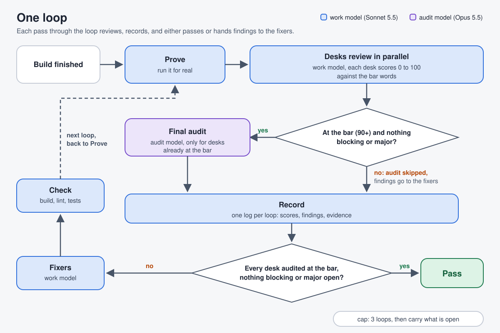
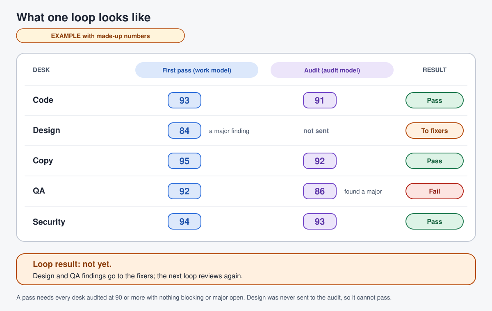
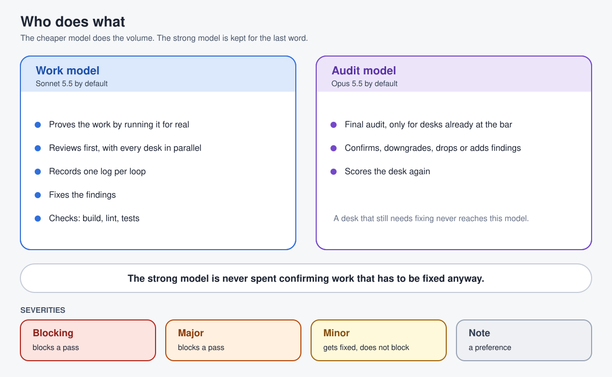

# scored-review-loop

A Claude Code skill for judging finished build work. Review desks, each with one lens, score the work 0 to 100 against your bar words. A cheap model does the first pass, the fixing and the paperwork, and the strong model audits only the desks that are already at the bar. Findings go to fixers, one check step runs, and the loop repeats up to a cap.



In short:

- Each desk has one lens and scores the work 0 to 100 against your bar words (default: functional, professional, premium, clean, easy to use).
- The work model reviews first. The audit model audits only desks already at the bar.
- A loop passes only when every desk is at the bar, none has a blocking or major finding open, and every desk was audited.

## What a loop looks like



## Who does what



## Install in a repo (project skill, not global)

```
git clone https://github.com/BespokeWoodcraftStudio/scored-review-loop.git /tmp/scored-review-loop
mkdir -p <repo>/.claude/skills && rsync -a --exclude .git /tmp/scored-review-loop/ <repo>/.claude/skills/scored-review-loop/
cp <repo>/.claude/skills/scored-review-loop/scored-review-loop.example.json <repo>/.claude/scored-review-loop.json
```

Edit `.claude/scored-review-loop.json`: root, scope, desks, prove, checkCommands. Leave `.git` out of the copy, or `git add` records an embedded repo and teammates get no files.

It loads as a project skill in that repo only. It is not installed in your home folder, so no other repo sees it. To use it in another repo, run the same three lines there. Commit `.claude/skills/scored-review-loop` and `.claude/scored-review-loop.json` if you want the team to share them.

## Run a review loop

Option A, the workflow script. Needs Claude Code with the Workflow tool.

1. Copy `scripts/review-loop.js` to a scratch path.
2. Ask Claude to run it with the Workflow tool, `args` taken from `.claude/scored-review-loop.json`.
3. Or bake the settings in and launch the copy by path:
   `python3 .claude/skills/scored-review-loop/scripts/make-run.py .claude/skills/scored-review-loop/scripts/review-loop.js .claude/scored-review-loop.json /scratch/run.js my-run`

Option B, by hand. No Workflow tool. Tell Claude "review this with the scored-review-loop skill" and it launches one agent per desk with the Agent tool, using the models below (the model id, or the alias your Agent tool accepts, from the session's model list). `SKILL.md` has the steps.

Logs land in `logDir` (default `docs/review-log`), one per loop.

## Change the models

Set `workModel` and `auditModel` in `.claude/scored-review-loop.json`. Defaults are `claude-sonnet-5-5` and `claude-opus-5-5`. Read the ids from your session's model list; do not guess, a wrong id fails every agent.

## Add your own desks

Put role files in a folder, set `rolesDir` to it, and add desk objects to `desks`. See `references/role-template.md` and `references/desks.md`.

## Files

| File | What it is |
|---|---|
| `SKILL.md` | The skill: trigger, desk model, score, severities, pass rule, flow, cost rules |
| `references/desks.md` | Default desks and how to route only the ones a change touches |
| `references/findings.md` | Severities with examples, findings JSON, loop log template, carry rule |
| `references/role-template.md` | Template for a desk role file |
| `scripts/review-loop.js` | The generic workflow script |
| `scripts/make-run.py` | Bakes a settings file into a copy of the script |
| `scored-review-loop.example.json` | Example settings for a generic web app |
| `assets/` | The three SVG images used in this README |

## Requirements

- Claude Code.
- The Workflow tool for option A. Option B needs only the Agent tool.
- Python 3 for `make-run.py`.

## License

No license has been chosen yet, so all rights are reserved by the owner until a LICENSE file is added. Open an issue to ask about use.
